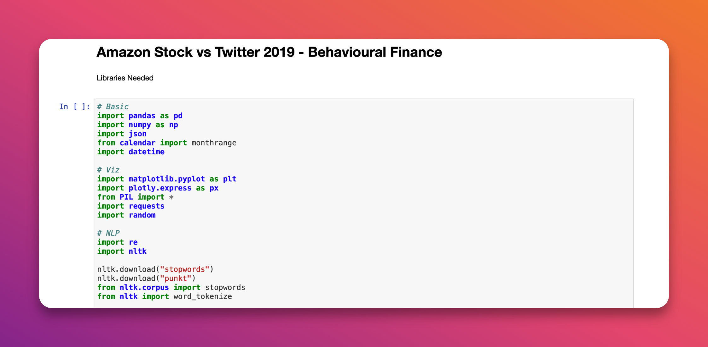

# Amazon Stock vs Twitter 2019  
> A parallel between Twitter and the Stock Market

The question behind the project is : **Does Twitter influence the stock market ?**

The project attempts to link tweets to the financial market by using sentiment analysis and determining whether media discussions influence stock prices.

## The data (tweets scrapped)

Data are tweets from the entire year of 2019 with the keyword $AMZN.

## Analysis

The jupyter notebook **[Main_Analysis_AMZN](https://nbviewer.org/github/npogeant/amzn2019/blob/main/Main_Analysis_AMZN.ipynb)** in the repository is a large part of the analysis from the descriptive one to the opinion mining.

  

I also wrote an **[article](https://npogeant.medium.com/the-amazon-stock-vs-twitter-in-2019-931c88831fc1)** on medium explaning with details the analysis from the beginning and using stock market data to observe results.